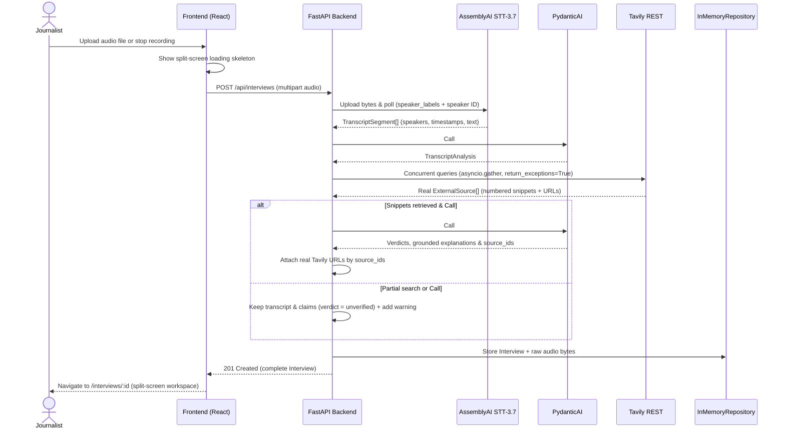

# Capture & Initial Fact-Check Flow

Sequence of events when a journalist uploads an audio file or stops a browser recording (`POST /api/interviews`).

```mermaid
sequenceDiagram
    actor Journalist
    participant UI as Frontend (React)
    participant API as FastAPI Backend
    participant STT as AssemblyAI STT-3.7
    participant LLM as PydanticAI
    participant Search as Tavily REST
    participant Repo as InMemoryRepository

    Journalist->>UI: Upload audio file or stop recording
    UI->>UI: Show split-screen loading skeleton
    UI->>API: POST /api/interviews (multipart audio)
    API->>STT: Upload bytes & poll (speaker_labels + speaker ID)
    STT-->>API: TranscriptSegment[] (speakers, timestamps, text)

    API->>LLM: Call #1 — extract summary, topics, AI claims & search queries
    LLM-->>API: TranscriptAnalysis

    API->>Search: Concurrent queries (asyncio.gather, return_exceptions=True)
    Search-->>API: Real ExternalSource[] (numbered snippets + URLs)

    alt Snippets retrieved & Call #2 succeeds
        API->>LLM: Call #2 — verify claims against numbered snippets
        LLM-->>API: Verdicts, grounded explanations & source_ids
        API->>API: Attach real Tavily URLs by source_ids
    else Partial search or Call #2 failure
        API->>API: Keep transcript & claims (verdict = unverified) + add warning
    end

    API->>Repo: Store Interview + raw audio bytes
    API-->>UI: 201 Created (complete Interview)
    UI-->>Journalist: Navigate to /interviews/:id (split-screen workspace)
```
